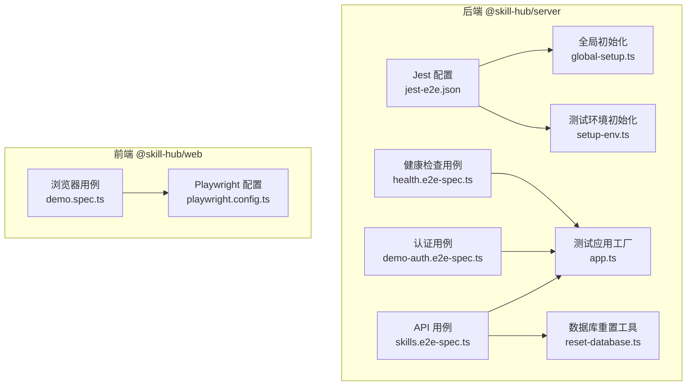
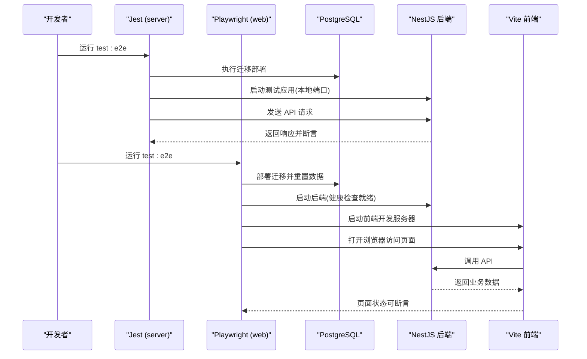
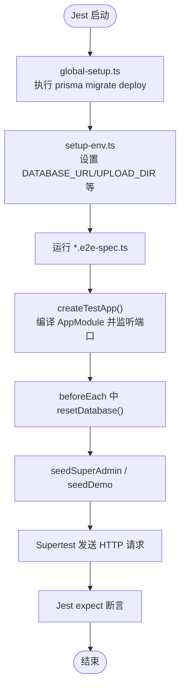
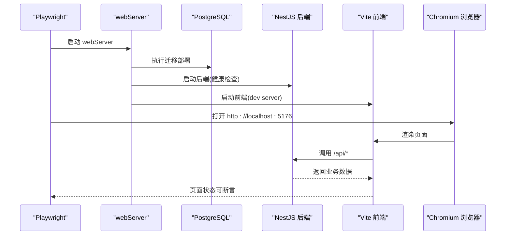
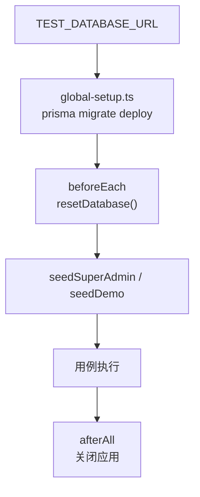
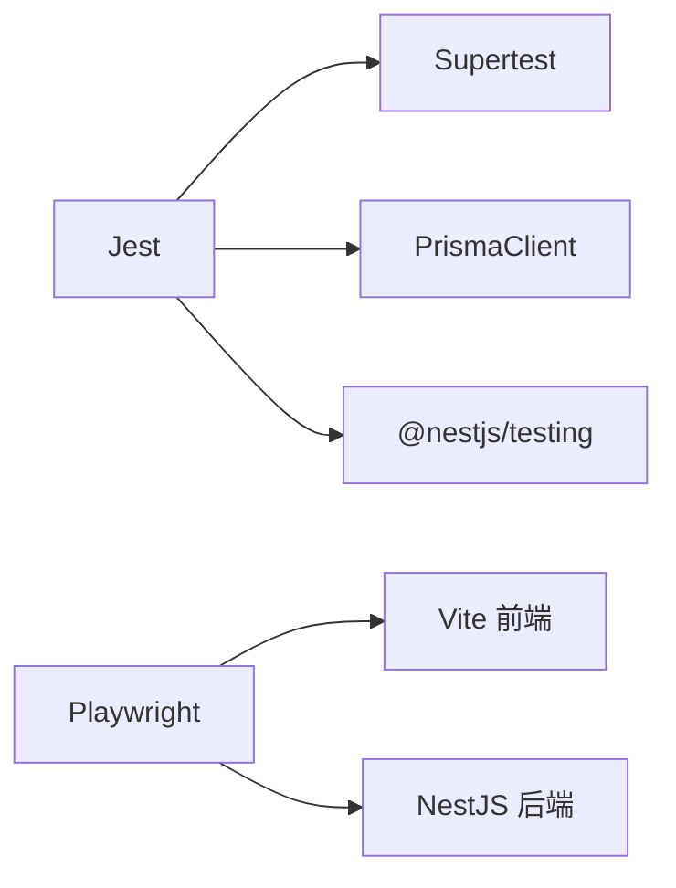

# 测试策略

<cite>
**本文引用的文件**   
- [apps/server/test/jest-e2e.json](file://apps/server/test/jest-e2e.json)
- [apps/server/test/global-setup.ts](file://apps/server/test/global-setup.ts)
- [apps/server/test/setup-env.ts](file://apps/server/test/setup-env.ts)
- [apps/server/test/reset-database.ts](file://apps/server/test/reset-database.ts)
- [apps/server/test/reset-db.ts](file://apps/server/test/reset-db.ts)
- [apps/server/test/test-database.ts](file://apps/server/test/test-database.ts)
- [apps/server/test/app.ts](file://apps/server/test/app.ts)
- [apps/server/test/skills.e2e-spec.ts](file://apps/server/test/skills.e2e-spec.ts)
- [apps/server/test/demo-auth.e2e-spec.ts](file://apps/server/test/demo-auth.e2e-spec.ts)
- [apps/server/test/health.e2e-spec.ts](file://apps/server/test/health.e2e-spec.ts)
- [apps/web/playwright.config.ts](file://apps/web/playwright.config.ts)
- [apps/web/e2e/demo.spec.ts](file://apps/web/e2e/demo.spec.ts)
- [apps/server/package.json](file://apps/server/package.json)
- [apps/web/package.json](file://apps/web/package.json)
</cite>

## 目录
1. [引言](#引言)
2. [项目结构](#项目结构)
3. [核心组件](#核心组件)
4. [架构总览](#架构总览)
5. [详细组件分析](#详细组件分析)
6. [依赖关系分析](#依赖关系分析)
7. [性能与稳定性考虑](#性能与稳定性考虑)
8. [故障排查指南](#故障排查指南)
9. [结论](#结论)

## 引言
本测试策略文档面向后端 NestJS API 的端到端测试与前端的 Playwright 浏览器端到端测试，目标是帮助测试人员快速搭建测试环境、编写高质量用例、维护稳定的测试套件。文档覆盖以下主题：
- 测试框架选型与职责边界：Jest + Supertest（服务端 API E2E），Playwright（前端浏览器 E2E）
- 测试环境搭建：数据库隔离、环境变量、前后端服务启动
- 测试数据管理：数据库重置、种子数据、上传目录隔离
- 用例组织与命名约定
- 断言库与自定义匹配器使用建议
- 覆盖率要求与报告生成方法
- 持续集成中的测试执行配置
- 调试技巧与常见问题解决方案

## 项目结构
本项目采用 monorepo 结构，测试代码分布在两个应用内：
- apps/server：NestJS 后端，使用 Jest 运行基于 Supertest 的 API 端到端测试
- apps/web：React 前端，使用 Playwright 运行浏览器端到端测试

图表来源
- [apps/server/test/jest-e2e.json:1-10](file://apps/server/test/jest-e2e.json#L1-L10)
- [apps/server/test/global-setup.ts:1-10](file://apps/server/test/global-setup.ts#L1-L10)
- [apps/server/test/setup-env.ts:1-12](file://apps/server/test/setup-env.ts#L1-L12)
- [apps/server/test/reset-database.ts:1-13](file://apps/server/test/reset-database.ts#L1-L13)
- [apps/server/test/app.ts:1-14](file://apps/server/test/app.ts#L1-L14)
- [apps/web/playwright.config.ts:1-21](file://apps/web/playwright.config.ts#L1-L21)

章节来源
- [apps/server/test/jest-e2e.json:1-10](file://apps/server/test/jest-e2e.json#L1-L10)
- [apps/web/playwright.config.ts:1-21](file://apps/web/playwright.config.ts#L1-L21)

## 核心组件
本节梳理测试体系的核心模块及其职责：
- Jest 端到端测试入口与配置
  - 配置文件定义测试根目录、正则匹配规则、Node 环境、ts-jest 转换、全局初始化与 setup 文件
- 测试应用工厂
  - 编译 AppModule、创建 Nest 应用、监听本地端口并返回 PrismaService 实例
- 数据库重置与隔离
  - 仅允许在测试数据库上执行 TRUNCATE；保留迁移表；提供命令行脚本重置并填充种子数据
- Playwright 端到端测试
  - 自动拉起后端与前端服务，设置工作目录、超时、截图与追踪、浏览器设备配置等

章节来源
- [apps/server/test/jest-e2e.json:1-10](file://apps/server/test/jest-e2e.json#L1-L10)
- [apps/server/test/app.ts:1-14](file://apps/server/test/app.ts#L1-L14)
- [apps/server/test/reset-database.ts:1-13](file://apps/server/test/reset-database.ts#L1-L13)
- [apps/server/test/reset-db.ts:1-8](file://apps/server/test/reset-db.ts#L1-L8)
- [apps/web/playwright.config.ts:1-21](file://apps/web/playwright.config.ts#L1-L21)

## 架构总览
下图展示端到端测试的整体流程：Jest 启动后执行全局初始化，加载测试环境，随后运行 API 用例；Playwright 启动时先部署数据库、重置数据并启动后端，再启动前端，最后执行浏览器用例。

图表来源
- [apps/server/test/global-setup.ts:1-10](file://apps/server/test/global-setup.ts#L1-L10)
- [apps/server/test/jest-e2e.json:1-10](file://apps/server/test/jest-e2e.json#L1-L10)
- [apps/web/playwright.config.ts:12-19](file://apps/web/playwright.config.ts#L12-L19)

## 详细组件分析

### Jest 端到端测试（API）
- 配置要点
  - 测试根目录指向 server 根目录
  - 通过正则只匹配 test 目录下的 e2e 用例
  - Node 环境，ts-jst 转换 TypeScript
  - 通过 setupFiles 注入测试环境变量
  - 通过 globalSetup 统一执行数据库迁移
- 测试应用工厂
  - 编译 AppModule，创建 Nest 应用，监听 127.0.0.1 随机端口，避免端口冲突
  - 返回 PrismaService 以便用例直接操作数据库进行校验
- 数据库重置
  - resetDatabase 仅对以 _test 结尾的数据库执行 TRUNCATE，保护非测试库
  - 保留 _prisma_migrations 表，确保迁移记录不被误删
- 典型用例
  - skills.e2e-spec.ts：覆盖 Skill 上传、版本管理、下载、权限、租户隔离、并发竞争等
  - demo-auth.e2e-spec.ts：覆盖固定演示账号登录、会话持久化、鉴权边界、路由白名单
  - health.e2e-spec.ts：验证健康检查接口返回预期状态

图表来源
- [apps/server/test/jest-e2e.json:1-10](file://apps/server/test/jest-e2e.json#L1-L10)
- [apps/server/test/global-setup.ts:1-10](file://apps/server/test/global-setup.ts#L1-L10)
- [apps/server/test/setup-env.ts:1-12](file://apps/server/test/setup-env.ts#L1-L12)
- [apps/server/test/app.ts:1-14](file://apps/server/test/app.ts#L1-L14)
- [apps/server/test/reset-database.ts:1-13](file://apps/server/test/reset-database.ts#L1-L13)

章节来源
- [apps/server/test/jest-e2e.json:1-10](file://apps/server/test/jest-e2e.json#L1-L10)
- [apps/server/test/app.ts:1-14](file://apps/server/test/app.ts#L1-L14)
- [apps/server/test/reset-database.ts:1-13](file://apps/server/test/reset-database.ts#L1-L13)
- [apps/server/test/skills.e2e-spec.ts:1-454](file://apps/server/test/skills.e2e-spec.ts#L1-L454)
- [apps/server/test/demo-auth.e2e-spec.ts:1-87](file://apps/server/test/demo-auth.e2e-spec.ts#L1-L87)
- [apps/server/test/health.e2e-spec.ts:1-23](file://apps/server/test/health.e2e-spec.ts#L1-L23)

### Playwright 端到端测试（浏览器）
- 配置要点
  - 测试目录为 e2e，单 worker，禁用并行
  - 默认 Chromium 桌面设备，视口 1440x1000
  - 启用失败截图与 trace 保留
  - webServer 同时启动后端与前端：
    - 后端：部署数据库、重置数据、启动服务，暴露健康检查
    - 前端：启动 Vite dev server，代理到后端
- 用例组织
  - demo.spec.ts：覆盖登录、上传、审核、版本差异、可见性、搜索、移动端适配、拖拽上传等场景
- 数据与环境
  - 通过环境变量 TEST_DATABASE_URL 指定测试数据库
  - 私有上传目录使用系统临时目录，避免污染开发环境

图表来源
- [apps/web/playwright.config.ts:1-21](file://apps/web/playwright.config.ts#L1-L21)
- [apps/web/e2e/demo.spec.ts:1-231](file://apps/web/e2e/demo.spec.ts#L1-L231)

章节来源
- [apps/web/playwright.config.ts:1-21](file://apps/web/playwright.config.ts#L1-L21)
- [apps/web/e2e/demo.spec.ts:1-231](file://apps/web/e2e/demo.spec.ts#L1-L231)

### 测试数据管理与数据库隔离
- 测试数据库地址
  - 统一从 TEST_DATABASE_URL 读取，默认指向 docker-compose.dev.yml 中的 skill_hub_demo_test
- 全局迁移
  - global-setup 在执行任何用例前执行 prisma migrate deploy，保证表结构一致
- 每次用例前清空业务表
  - resetDatabase 仅 TRUNCATE public schema 下除 _prisma_migrations 之外的所有表
  - 强制要求数据库名以 _test 结尾，防止误删生产或开发库
- 种子数据
  - reset-db.ts 提供一键重置并填充演示数据的脚本
  - skills.e2e-spec.ts 中通过 seedSuperAdmin 和 tenantAdminAgent/employeeAgent 构造多租户角色
  - demo-auth.e2e-spec.ts 使用 seedDemo 注入固定演示账号

图表来源
- [apps/server/test/test-database.ts:1-4](file://apps/server/test/test-database.ts#L1-L4)
- [apps/server/test/global-setup.ts:1-10](file://apps/server/test/global-setup.ts#L1-L10)
- [apps/server/test/reset-database.ts:1-13](file://apps/server/test/reset-database.ts#L1-L13)
- [apps/server/test/reset-db.ts:1-8](file://apps/server/test/reset-db.ts#L1-L8)

章节来源
- [apps/server/test/test-database.ts:1-4](file://apps/server/test/test-database.ts#L1-L4)
- [apps/server/test/global-setup.ts:1-10](file://apps/server/test/global-setup.ts#L1-L10)
- [apps/server/test/reset-database.ts:1-13](file://apps/server/test/reset-database.ts#L1-L13)
- [apps/server/test/reset-db.ts:1-8](file://apps/server/test/reset-db.ts#L1-L8)

### 用例组织结构与命名约定
- 位置规范
  - 后端 API 用例位于 apps/server/test/*.e2e-spec.ts
  - 前端浏览器用例位于 apps/web/e2e/*.spec.ts
- 命名约定
  - 文件名以 .e2e-spec.ts 或 .spec.ts 结尾，便于 Jest 与 Playwright 分别识别
  - describe 块按功能域划分（如“Skill /api/skills”、“Fixed demo identities and persistence”）
  - it 描述应表达具体行为与预期结果，包含角色、资源、动作与约束
- 用例粒度
  - 每个 it 聚焦一个明确场景，必要时使用 it.each 覆盖参数组合
  - 复杂流程拆分为多个步骤函数（如 login、logout、upload、confirm）

章节来源
- [apps/server/test/skills.e2e-spec.ts:1-454](file://apps/server/test/skills.e2e-spec.ts#L1-L454)
- [apps/server/test/demo-auth.e2e-spec.ts:1-87](file://apps/server/test/demo-auth.e2e-spec.ts#L1-L87)
- [apps/web/e2e/demo.spec.ts:1-231](file://apps/web/e2e/demo.spec.ts#L1-L231)

### 断言库与自定义匹配器
- 后端
  - 使用 Jest 内置 expect 进行对象结构、数组顺序、日期范围、错误消息等断言
  - 结合 PrismaService 直接查询数据库进行强一致性校验
- 前端
  - 使用 Playwright expect 进行 DOM 可见性、URL 跳转、网络响应状态、截图比对等断言
- 自定义匹配器建议
  - 将重复的断言封装为辅助函数（如“断言当前用户角色菜单项”、“断言 Skill 列表排序”）
  - 针对业务语义封装匹配器（如“断言 Skill 包解压后的文件集合”）

章节来源
- [apps/server/test/skills.e2e-spec.ts:1-454](file://apps/server/test/skills.e2e-spec.ts#L1-L454)
- [apps/web/e2e/demo.spec.ts:1-231](file://apps/web/e2e/demo.spec.ts#L1-L231)

### 测试覆盖率与报告
- 覆盖率
  - 当前仓库未配置 Jest 覆盖率插件，建议在 CI 中按需开启 jest --coverage 并设定阈值
- 报告
  - Playwright 已配置 HTML 报告（open: never），可在失败后查看
  - 建议在后端也启用 Jest 报告输出，便于定位问题

章节来源
- [apps/web/playwright.config.ts:7-10](file://apps/web/playwright.config.ts#L7-L10)

### 持续集成中的测试执行
- 后端
  - scripts.test:e2e 使用 jest --config test/jest-e2e.json --runInBand 串行执行，避免并发导致的端口或连接问题
- 前端
  - scripts.test:e2e 使用 playwright test，由 playwright.config.ts 控制 webServer 启动与浏览器行为
- 建议
  - 在 CI 中先准备数据库（migrate + reset），再依次运行后端与前端 E2E
  - 在 CI 中开启 Playwright 失败截图与 trace 收集，便于远程调试

章节来源
- [apps/server/package.json:10-21](file://apps/server/package.json#L10-L21)
- [apps/web/package.json:6-13](file://apps/web/package.json#L6-L13)
- [apps/web/playwright.config.ts:7-19](file://apps/web/playwright.config.ts#L7-L19)

## 依赖关系分析
- 后端测试依赖
  - @nestjs/testing 用于创建测试应用
  - supertest 用于发送 HTTP 请求
  - prisma client 用于数据库校验
  - fflate 用于处理 zip 二进制数据
- 前端测试依赖
  - @playwright/test 提供浏览器自动化能力
  - fflate 用于构造 zip 文件内容

图表来源
- [apps/server/package.json:22-53](file://apps/server/package.json#L22-L53)
- [apps/web/package.json:14-32](file://apps/web/package.json#L14-L32)

章节来源
- [apps/server/package.json:22-53](file://apps/server/package.json#L22-L53)
- [apps/web/package.json:14-32](file://apps/web/package.json#L14-L32)

## 性能与稳定性考虑
- 数据库连接
  - setup-env.ts 关闭 Node 全局 Agent keepAlive，避免复用已关闭的连接导致 ECONNRESET
- 端口复用
  - createTestApp 监听 127.0.0.1 随机端口，避免端口冲突
- 并发控制
  - Playwright 使用 workers: 1 与 fullyParallel: false，降低浏览器与后端资源竞争
  - Jest 使用 --runInBand 串行执行，减少并发带来的不稳定
- 资源隔离
  - 上传目录使用系统临时目录，避免污染开发环境
  - 仅允许 _test 数据库被重置，防止误删数据

章节来源
- [apps/server/test/setup-env.ts:9-12](file://apps/server/test/setup-env.ts#L9-L12)
- [apps/server/test/app.ts:10-12](file://apps/server/test/app.ts#L10-L12)
- [apps/web/playwright.config.ts:7-11](file://apps/web/playwright.config.ts#L7-L11)
- [apps/server/test/reset-database.ts:4-12](file://apps/server/test/reset-database.ts#L4-L12)

## 故障排查指南
- 常见错误
  - ECONNRESET / Parse Error：通常由连接复用导致，已在 setup-env.ts 中修复
  - 端口占用：createTestApp 使用随机端口，若仍冲突请检查是否有残留进程
  - 数据库误操作：resetDatabase 会拒绝非 _test 数据库，确认 TEST_DATABASE_URL 正确
  - 浏览器测试失败：检查 playwright.config.ts 中 webServer 命令是否成功启动后端与前端
- 调试技巧
  - Playwright：启用 trace 与失败截图，查看 UI 状态变化
  - Jest：使用 --runInBand 串行执行，缩小问题范围
  - 数据库：通过 reset-db.ts 重置并填充种子数据，确保基线一致
- 日志与断点
  - 在 createTestApp 与 webServer 启动处添加日志，确认服务就绪
  - 在关键 API 与页面交互处增加断言，逐步定位问题

章节来源
- [apps/server/test/setup-env.ts:9-12](file://apps/server/test/setup-env.ts#L9-L12)
- [apps/server/test/app.ts:10-12](file://apps/server/test/app.ts#L10-L12)
- [apps/server/test/reset-database.ts:4-12](file://apps/server/test/reset-database.ts#L4-L12)
- [apps/web/playwright.config.ts:7-19](file://apps/web/playwright.config.ts#L7-L19)

## 结论
本测试策略通过 Jest + Supertest 与 Playwright 的组合，覆盖了后端 API 与前端浏览器的端到端场景。借助严格的数据库隔离、统一的初始化流程与清晰的用例组织，测试套件具备高稳定性与可维护性。建议在后续迭代中：
- 引入 Jest 覆盖率并在 CI 中设定阈值
- 继续沉淀业务断言辅助函数与自定义匹配器
- 在 CI 中完善报告收集与失败重试策略
- 保持用例命名与结构的统一，提升可读性与协作效率