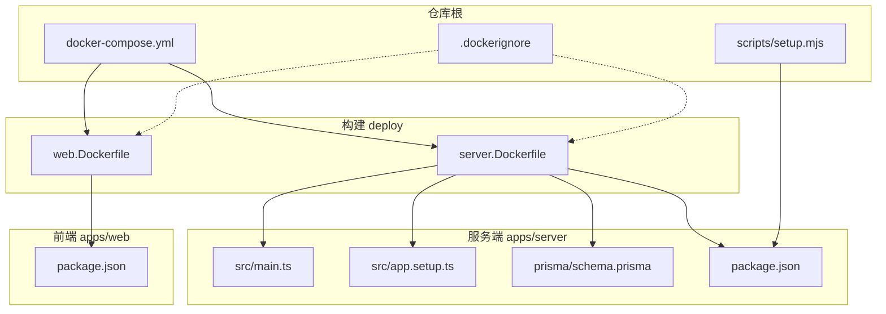
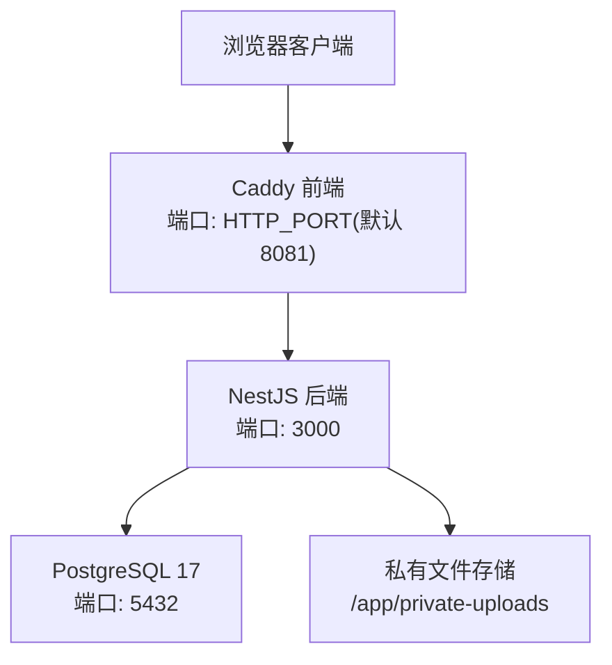
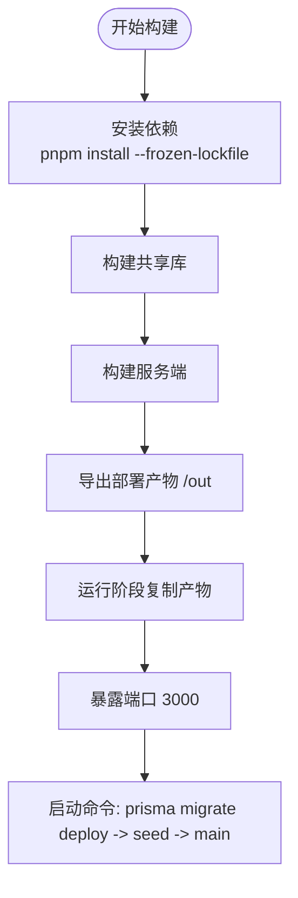
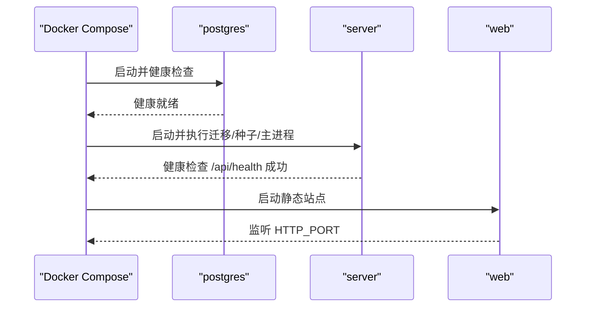
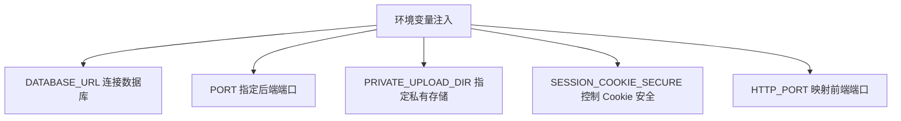
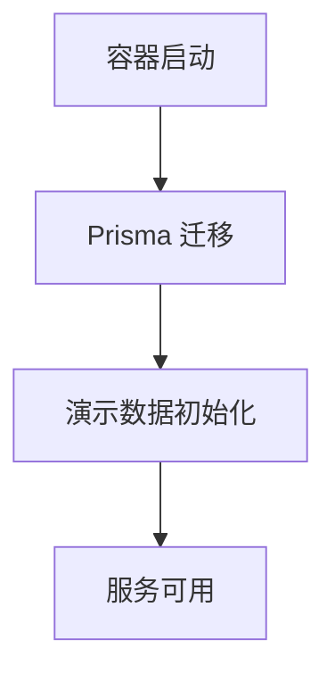
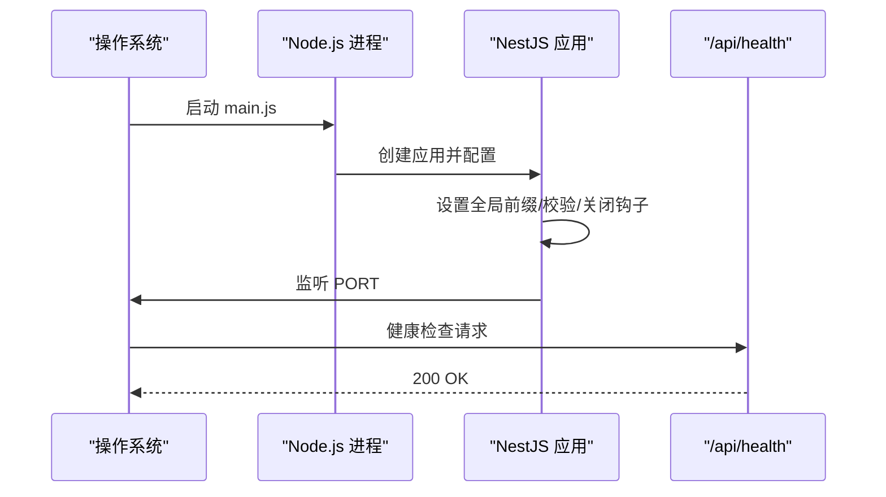
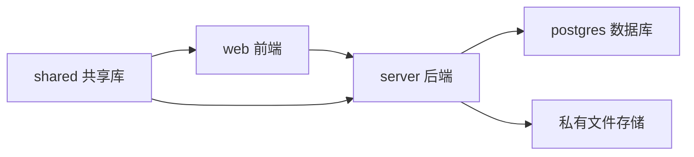
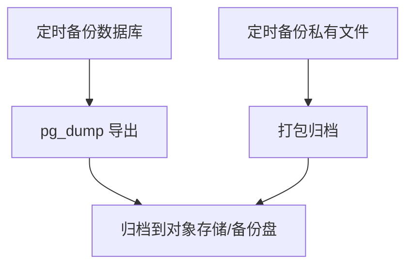

# 部署指南

<cite>
**本文引用的文件**   
- [README.md](file://README.md)
- [docker-compose.yml](file://docker-compose.yml)
- [docker-compose.dev.yml](file://docker-compose.dev.yml)
- [server.Dockerfile](file://deploy/server.Dockerfile)
- [web.Dockerfile](file://deploy/web.Dockerfile)
- [.dockerignore](file://.dockerignore)
- [apps/server/package.json](file://apps/server/package.json)
- [apps/web/package.json](file://apps/web/package.json)
- [apps/server/src/main.ts](file://apps/server/src/main.ts)
- [apps/server/src/app.setup.ts](file://apps/server/src/app.setup.ts)
- [apps/server/src/seed.ts](file://apps/server/src/seed.ts)
- [apps/server/prisma/schema.prisma](file://apps/server/prisma/schema.prisma)
- [apps/server/src/auth/session.ts](file://apps/server/src/auth/session.ts)
- [apps/server/src/storage/private-file-storage.ts](file://apps/server/src/storage/private-file-storage.ts)
- [scripts/setup.mjs](file://scripts/setup.mjs)
</cite>

## 目录
1. [简介](#简介)
2. [项目结构](#项目结构)
3. [核心组件](#核心组件)
4. [架构总览](#架构总览)
5. [详细组件分析](#详细组件分析)
6. [依赖关系分析](#依赖关系分析)
7. [性能与容量规划](#性能与容量规划)
8. [监控、日志与可观测性](#监控日志与可观测性)
9. [数据库初始化、持久化与备份](#数据库初始化持久化与备份)
10. [环境变量与安全配置](#环境变量与安全配置)
11. [故障排查指南](#故障排查指南)
12. [结论](#结论)
13. [附录：生产部署清单](#附录生产部署清单)

## 简介
本指南面向运维与平台工程团队，提供 Skill Hub Teaching 的生产环境部署方案。内容覆盖容器镜像构建、编排与服务依赖、环境变量与安全、数据库初始化与数据持久化、备份策略、性能优化、监控告警与日志收集，以及常见问题的排障方法。读者可据此独立完成从镜像构建到上线运行的全流程。

## 项目结构
项目采用多包工作区（pnpm workspace），包含服务端 NestJS 应用、前端 React 应用、共享类型库、Docker 构建脚本与 Compose 编排文件。关键路径如下：
- 服务端：apps/server
- 前端：apps/web
- 共享库：packages/shared
- Docker 构建：deploy/server.Dockerfile、deploy/web.Dockerfile
- 编排：docker-compose.yml、docker-compose.dev.yml
- 根级忽略：.dockerignore

图示来源
- [docker-compose.yml:1-48](file://docker-compose.yml#L1-L48)
- [server.Dockerfile:1-26](file://deploy/server.Dockerfile#L1-L26)
- [web.Dockerfile:1-16](file://deploy/web.Dockerfile#L1-L16)
- [.dockerignore:1-12](file://.dockerignore#L1-L12)
- [apps/server/package.json:1-55](file://apps/server/package.json#L1-L55)
- [apps/web/package.json:1-34](file://apps/web/package.json#L1-L34)
- [scripts/setup.mjs:1-8](file://scripts/setup.mjs#L1-L8)

章节来源
- [README.md:1-67](file://README.md#L1-L67)
- [docker-compose.yml:1-48](file://docker-compose.yml#L1-L48)
- [docker-compose.dev.yml:1-20](file://docker-compose.dev.yml#L1-L20)
- [server.Dockerfile:1-26](file://deploy/server.Dockerfile#L1-L26)
- [web.Dockerfile:1-16](file://deploy/web.Dockerfile#L1-L16)
- [.dockerignore:1-12](file://.dockerignore#L1-L12)

## 核心组件
- 数据库服务：PostgreSQL 17 Alpine，使用命名卷持久化数据。
- 后端服务：NestJS + Prisma，暴露健康检查端点，启动前执行迁移与演示数据初始化。
- 前端服务：Caddy 静态站点服务器，托管 Vite 构建产物。
- 存储：私有上传目录通过独立命名卷持久化，不对外直接暴露。

章节来源
- [docker-compose.yml:3-47](file://docker-compose.yml#L3-L47)
- [server.Dockerfile:19-25](file://deploy/server.Dockerfile#L19-L25)
- [web.Dockerfile:13-16](file://deploy/web.Dockerfile#L13-L16)
- [apps/server/src/storage/private-file-storage.ts:20-40](file://apps/server/src/storage/private-file-storage.ts#L20-L40)

## 架构总览
系统由三个主要容器组成：PostgreSQL、NestJS 后端、Caddy 前端。Compose 保证启动顺序与健康检查，确保数据库就绪后再启动后端，后端就绪后再启动前端。

图示来源
- [docker-compose.yml:3-47](file://docker-compose.yml#L3-L47)
- [web.Dockerfile:13-16](file://deploy/web.Dockerfile#L13-L16)
- [server.Dockerfile:23-25](file://deploy/server.Dockerfile#L23-L25)
- [apps/server/src/storage/private-file-storage.ts:20-40](file://apps/server/src/storage/private-file-storage.ts#L20-L40)

## 详细组件分析

### 容器镜像构建
- 后端镜像
  - 基础镜像：node:22-bookworm-slim，安装 openssl 以匹配 Prisma schema-engine。
  - 构建阶段：启用 corepack，安装依赖并构建 shared 与 server，最终输出可部署产物到 /out。
  - 运行阶段：复制构建产物，设置 NODE_ENV=production，暴露 3000 端口；启动命令先执行 Prisma 迁移，再运行 seed，最后启动主进程。
- 前端镜像
  - 构建阶段：基于 node:22 构建 Vite 产物至 apps/web/dist。
  - 运行阶段：基于 caddy:2-alpine，将 dist 复制到 /srv，并通过 Caddyfile 提供服务。

图示来源
- [server.Dockerfile:1-26](file://deploy/server.Dockerfile#L1-L26)
- [web.Dockerfile:1-16](file://deploy/web.Dockerfile#L1-L16)

章节来源
- [server.Dockerfile:1-26](file://deploy/server.Dockerfile#L1-L26)
- [web.Dockerfile:1-16](file://deploy/web.Dockerfile#L1-L16)
- [apps/server/package.json:10-20](file://apps/server/package.json#L10-L20)
- [apps/web/package.json:6-12](file://apps/web/package.json#L6-L12)

### 编排与服务依赖
- 服务定义
  - postgres：PostgreSQL 17 Alpine，设置用户名、密码、数据库名，挂载 demo_db 卷，健康检查使用 pg_isready。
  - server：构建自 server.Dockerfile，注入 DATABASE_URL、PORT、PRIVATE_UPLOAD_DIR、SESSION_COOKIE_SECURE，挂载 demo_packages 卷，depends_on postgres 且条件为 service_healthy，健康检查调用 /api/health。
  - web：构建自 web.Dockerfile，映射 127.0.0.1:${HTTP_PORT:-8081}:80，depends_on server 且条件为 service_healthy。
- 启动顺序
  - 先启动并等待 postgres 健康。
  - 再启动 server，等待其健康后启动 web。

图示来源
- [docker-compose.yml:3-47](file://docker-compose.yml#L3-L47)

章节来源
- [docker-compose.yml:1-48](file://docker-compose.yml#L1-L48)

### 环境变量与安全配置
- 运行时环境变量
  - DATABASE_URL：连接 PostgreSQL 的连接串。
  - PORT：后端监听端口（默认 3000）。
  - PRIVATE_UPLOAD_DIR：私有文件存储目录（默认 /app/private-uploads）。
  - SESSION_COOKIE_SECURE：Cookie 安全标志（开发为 false）。
  - HTTP_PORT：前端对外端口（默认 8081）。
- 安全要点
  - 会话 Cookie 名称固定为 skill_hub_demo_sid，会话过期时间 30 天。
  - 私有文件不通过静态路由公开，仅通过鉴权接口读取。
  - 建议在生产开启 HTTPS 与 Secure Cookie，并在反向代理层强制 TLS。

图示来源
- [docker-compose.yml:20-26](file://docker-compose.yml#L20-L26)
- [apps/server/src/auth/session.ts:3-23](file://apps/server/src/auth/session.ts#L3-L23)
- [apps/server/src/storage/private-file-storage.ts:20-40](file://apps/server/src/storage/private-file-storage.ts#L20-L40)

章节来源
- [docker-compose.yml:20-26](file://docker-compose.yml#L20-L26)
- [apps/server/src/auth/session.ts:1-30](file://apps/server/src/auth/session.ts#L1-L30)
- [apps/server/src/storage/private-file-storage.ts:1-41](file://apps/server/src/storage/private-file-storage.ts#L1-L41)

### 数据库模型与初始化流程
- 数据模型
  - 用户、租户、部门、员工、技能、技能版本、审核记录等实体，具备可见性与权限相关字段。
- 初始化流程
  - 容器启动时执行 Prisma 迁移，随后运行 seed 脚本初始化演示账号与团队。
  - 测试与演示数据隔离，避免污染生产数据。

图示来源
- [server.Dockerfile:24-25](file://deploy/server.Dockerfile#L24-L25)
- [apps/server/src/seed.ts:1-6](file://apps/server/src/seed.ts#L1-L6)
- [apps/server/prisma/schema.prisma:1-219](file://apps/server/prisma/schema.prisma#L1-L219)

章节来源
- [apps/server/prisma/schema.prisma:1-219](file://apps/server/prisma/schema.prisma#L1-L219)
- [apps/server/src/seed.ts:1-6](file://apps/server/src/seed.ts#L1-L6)
- [server.Dockerfile:24-25](file://deploy/server.Dockerfile#L24-L25)

### 应用启动与健康检查
- 后端启动
  - main.ts 加载 dotenv，创建 Nest 应用，调用 configureApp 设置全局前缀、Cookie 解析、校验管道与优雅关闭钩子，监听 PORT。
  - app.setup.ts 统一错误响应格式，便于前端展示第一条校验错误。
- 健康检查
  - docker-compose.yml 中 server 的健康检查调用 /api/health，返回 2xx 即视为健康。

图示来源
- [apps/server/src/main.ts:1-14](file://apps/server/src/main.ts#L1-L14)
- [apps/server/src/app.setup.ts:1-26](file://apps/server/src/app.setup.ts#L1-L26)
- [docker-compose.yml:30-35](file://docker-compose.yml#L30-L35)

章节来源
- [apps/server/src/main.ts:1-14](file://apps/server/src/main.ts#L1-L14)
- [apps/server/src/app.setup.ts:1-26](file://apps/server/src/app.setup.ts#L1-L26)
- [docker-compose.yml:30-35](file://docker-compose.yml#L30-L35)

## 依赖关系分析
- 服务间依赖
  - server 依赖 postgres（数据库）与本地文件系统（私有上传目录）。
  - web 依赖 server（API 网关/业务接口）。
- 构建依赖
  - server 构建依赖 shared 库与 NestJS 生态。
  - web 构建依赖 React、Ant Design、Vite 生态。

图示来源
- [docker-compose.yml:16-44](file://docker-compose.yml#L16-L44)
- [apps/server/package.json:22-36](file://apps/server/package.json#L22-L36)
- [apps/web/package.json:14-31](file://apps/web/package.json#L14-L31)

章节来源
- [docker-compose.yml:16-44](file://docker-compose.yml#L16-L44)
- [apps/server/package.json:22-36](file://apps/server/package.json#L22-L36)
- [apps/web/package.json:14-31](file://apps/web/package.json#L14-L31)

## 性能与容量规划
- 内存与 CPU
  - 建议在编排层为 server 与 web 设置资源限制（如 memory、cpus），防止单实例占用过多宿主机资源。
  - 根据并发与文件大小估算后端内存峰值，预留 GC 空间。
- 数据库连接池
  - Prisma 默认连接数较小，生产建议显式配置连接池大小，并结合数据库最大连接数进行容量规划。
- 静态资源缓存
  - Caddy 默认对静态资源启用缓存头，可结合 CDN 或反向代理进一步缓存。
- 文件存储
  - 私有上传目录建议使用高性能磁盘或对象存储（需替换 LocalPrivateFileStorage 实现）。
- 反向代理
  - 在 Caddy 或外部 Nginx/Traefik 上启用 Gzip/Brotli、Keep-Alive、HTTP/2 或 HTTP/3。

[本节为通用指导，不涉及具体代码文件]

## 监控日志与可观测性
- 指标与探针
  - 利用 Compose 健康检查作为基础存活探针；生产建议接入 Prometheus 抓取应用指标。
- 日志收集
  - 将后端标准输出与错误输出采集到集中式日志系统（如 Loki/Elasticsearch）。
  - 对文件访问与鉴权失败进行审计日志记录。
- 告警规则
  - 针对健康检查失败、数据库连接失败、上传失败、鉴权异常等事件设置告警。
- 追踪链路
  - 为关键接口添加请求 ID，贯穿前端、后端与存储访问日志。

[本节为通用指导，不涉及具体代码文件]

## 数据库初始化、持久化与备份
- 初始化
  - 容器启动自动执行 Prisma 迁移与演示数据初始化。
  - 首次部署可通过 scripts/setup.mjs 完成本地环境的 .env 生成、构建、迁移与种子。
- 持久化
  - 数据库数据通过 demo_db 卷持久化。
  - 私有文件通过 demo_packages 卷持久化。
- 备份策略
  - 定期使用 pg_dump 对数据库进行逻辑备份，保留多个历史版本。
  - 对 demo_packages 卷进行快照或归档，确保文件可恢复。
  - 制定 RPO/RTO 目标，验证恢复流程。

[本节为通用指导，不涉及具体代码文件]

章节来源
- [scripts/setup.mjs:1-8](file://scripts/setup.mjs#L1-L8)
- [docker-compose.yml:9-10](file://docker-compose.yml#L9-L10)
- [docker-compose.yml:25-26](file://docker-compose.yml#L25-L26)

## 环境变量与安全配置
- 推荐生产变量
  - DATABASE_URL：指向生产数据库，使用强密码与最小权限账户。
  - PORT：按需调整，通常由反向代理转发到 3000。
  - PRIVATE_UPLOAD_DIR：指向持久化存储路径。
  - SESSION_COOKIE_SECURE：true（配合 HTTPS）。
  - HTTP_PORT：由反向代理管理，不建议直接暴露。
- 安全加固
  - 禁用不必要的端口暴露，仅开放 80/443。
  - 使用只读根文件系统（可选），将写入目录挂载为独立卷。
  - 限制网络访问，仅允许必要端口互通。
  - 定期轮换密钥与凭据，使用密钥管理服务。

章节来源
- [docker-compose.yml:20-26](file://docker-compose.yml#L20-L26)
- [apps/server/src/auth/session.ts:3-23](file://apps/server/src/auth/session.ts#L3-L23)
- [apps/server/src/storage/private-file-storage.ts:20-40](file://apps/server/src/storage/private-file-storage.ts#L20-L40)

## 故障排查指南
- 容器无法启动
  - 检查 DATABASE_URL 是否正确，数据库是否可达。
  - 查看 server 健康检查日志，确认 /api/health 返回状态。
- 数据库连接失败
  - 核对 POSTGRES_USER/POSTGRES_PASSWORD/POSTGRES_DB 与连接串一致。
  - 检查 pg_isready 健康检查是否通过。
- 前端无法访问
  - 确认 HTTP_PORT 映射正确，Caddy 是否监听 80。
  - 检查后端服务是否健康，web 是否依赖 server 健康。
- 文件上传失败
  - 检查 PRIVATE_UPLOAD_DIR 是否存在并可写。
  - 确认 demo_packages 卷已挂载且权限正确。
- 会话失效
  - 检查 SESSION_COOKIE_SECURE 与 HTTPS 配置是否匹配。
  - 确认 Cookie 域名与路径设置正确。

章节来源
- [docker-compose.yml:11-15](file://docker-compose.yml#L11-L15)
- [docker-compose.yml:30-35](file://docker-compose.yml#L30-L35)
- [docker-compose.yml:40-44](file://docker-compose.yml#L40-L44)
- [apps/server/src/storage/private-file-storage.ts:20-40](file://apps/server/src/storage/private-file-storage.ts#L20-L40)
- [apps/server/src/auth/session.ts:3-23](file://apps/server/src/auth/session.ts#L3-L23)

## 结论
通过容器化与 Compose 编排，Skill Hub Teaching 实现了前后端分离、数据与文件持久化的生产就绪架构。遵循本指南的环境变量与安全配置、性能优化、监控日志与备份策略，可保障系统在稳定、安全、可观测的前提下高效运行。

[本节为总结性内容，不涉及具体代码文件]

## 附录：生产部署清单
- 前置准备
  - 准备 PostgreSQL 实例或容器，分配足够磁盘与内存。
  - 准备对象存储或高性能磁盘用于私有文件。
  - 准备反向代理（Caddy/Nginx/Traefik）并配置 TLS。
- 构建与发布
  - 构建后端与前端镜像，推送至镜像仓库。
  - 更新 Compose 文件中的镜像版本与环境变量。
- 部署步骤
  - 拉起 Compose 服务，等待健康检查通过。
  - 验证 /api/health 与前端页面可用性。
  - 导入初始数据（如需），验证演示账号登录。
- 运维维护
  - 定期备份数据库与私有文件。
  - 监控健康检查与关键指标，设置告警。
  - 滚动升级镜像，灰度发布与回滚预案。

[本节为通用指导，不涉及具体代码文件]