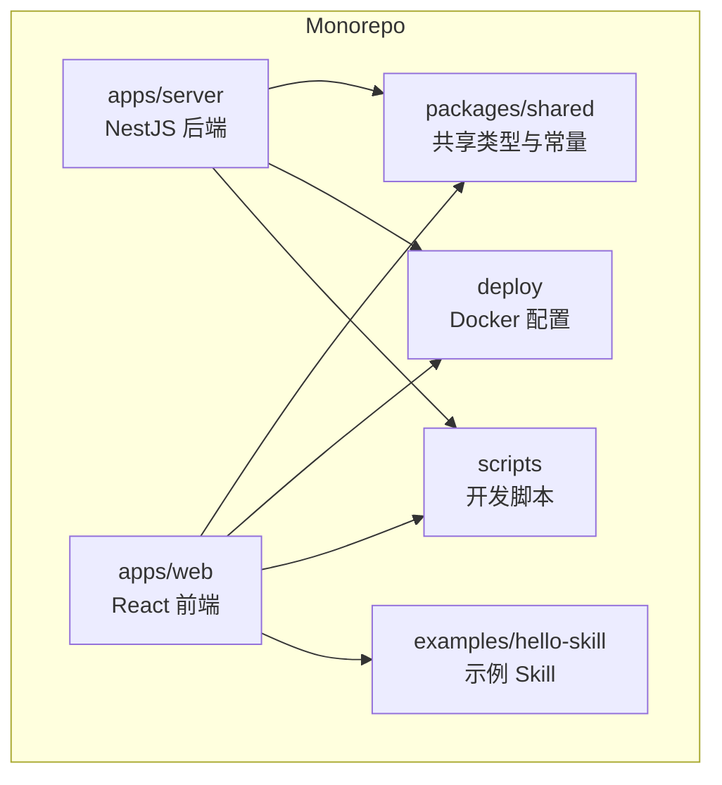
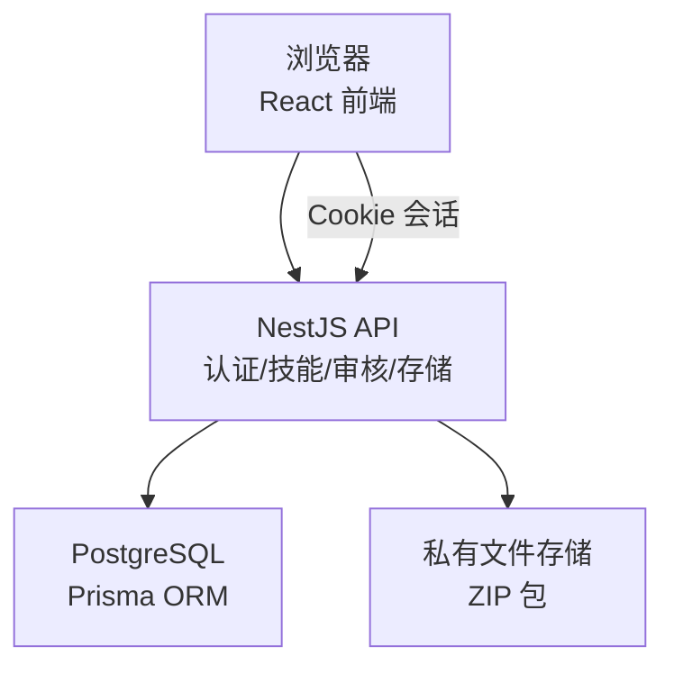
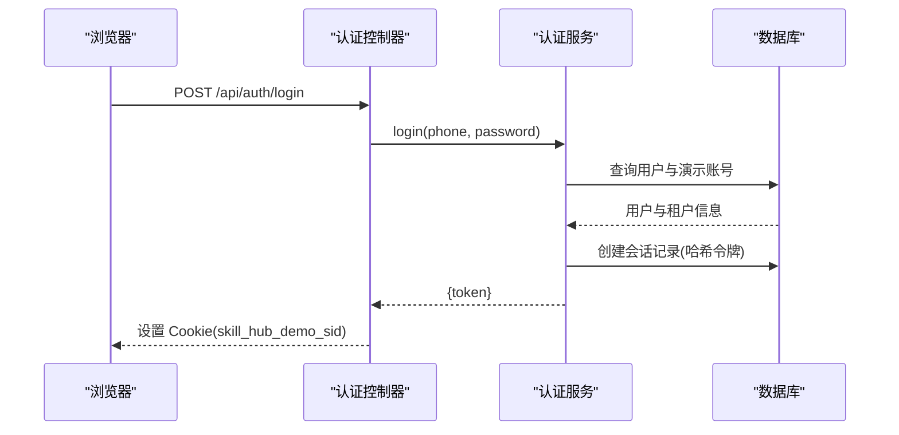
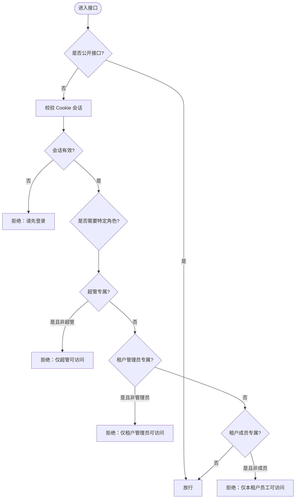
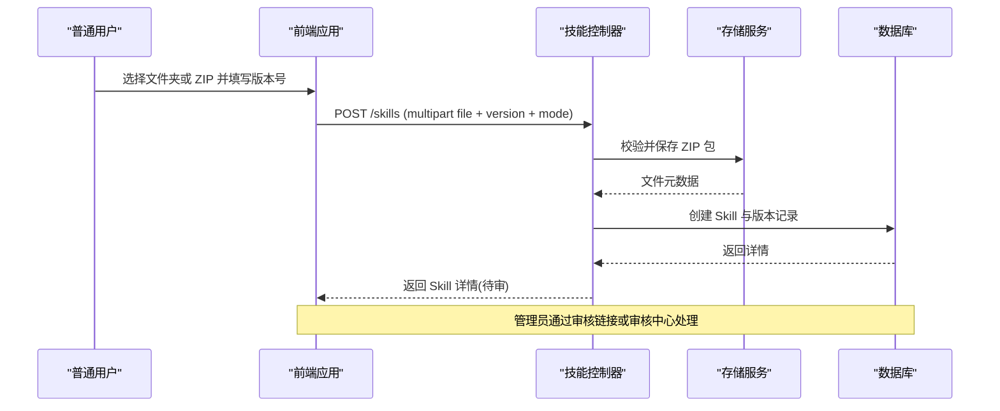
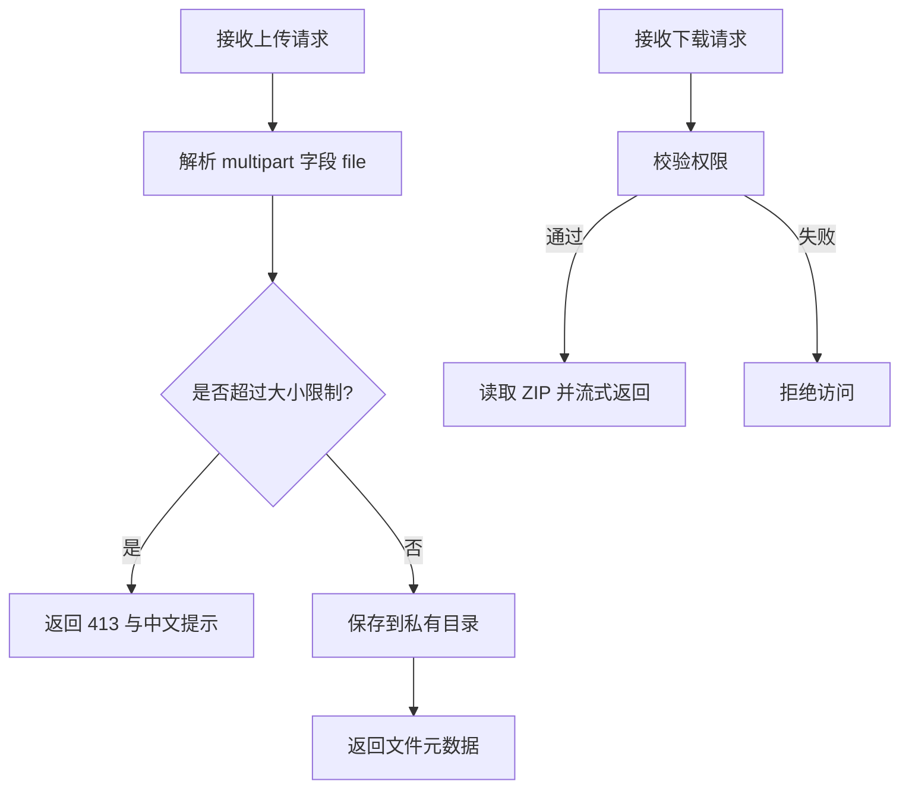
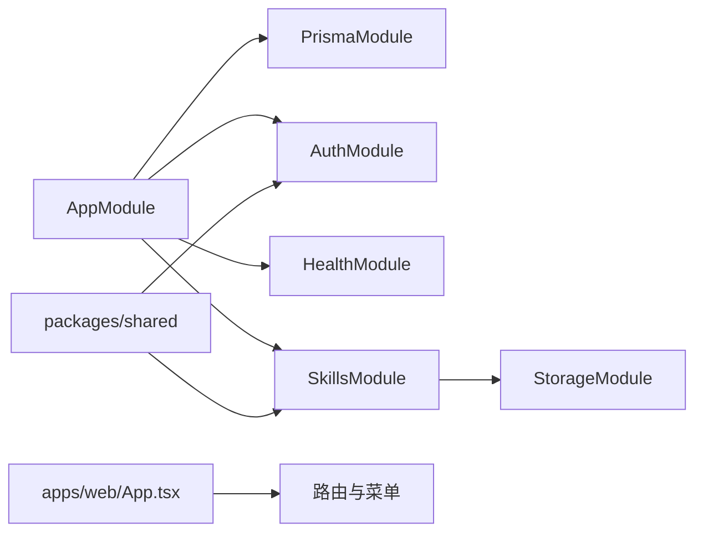

# 项目概述

<cite>
**本文引用的文件**   
- [README.md](file://README.md)
- [package.json](file://package.json)
- [apps/server/src/main.ts](file://apps/server/src/main.ts)
- [apps/server/src/app.module.ts](file://apps/server/src/app.module.ts)
- [apps/web/src/App.tsx](file://apps/web/src/App.tsx)
- [packages/shared/src/index.ts](file://packages/shared/src/index.ts)
- [packages/shared/src/auth.ts](file://packages/shared/src/auth.ts)
- [packages/shared/src/tenant.ts](file://packages/shared/src/tenant.ts)
- [apps/server/src/auth/auth.controller.ts](file://apps/server/src/auth/auth.controller.ts)
- [apps/server/src/auth/auth.service.ts](file://apps/server/src/auth/auth.service.ts)
- [apps/server/src/auth/auth.guard.ts](file://apps/server/src/auth/auth.guard.ts)
- [apps/server/src/skills/skills.controller.ts](file://apps/server/src/skills/skills.controller.ts)
- [apps/server/src/storage/file-upload.interceptor.ts](file://apps/server/src/storage/file-upload.interceptor.ts)
</cite>

## 目录
1. [简介](#简介)
2. [项目结构](#项目结构)
3. [核心组件](#核心组件)
4. [架构总览](#架构总览)
5. [关键组件详解](#关键组件详解)
6. [依赖关系分析](#依赖关系分析)
7. [性能与可扩展性](#性能与可扩展性)
8. [故障排查指南](#故障排查指南)
9. [结论](#结论)
10. [附录：快速开始与演示账号](#附录快速开始与演示账号)

## 简介
Skill Hub Teaching 是一个企业级技能管理平台，采用 Monorepo 架构，包含基于 NestJS 的后端服务、React 前端应用和共享类型库。平台提供多租户支持、细粒度权限控制、审核工作流、版本管理与私有文件存储等能力，适合教学与企业内部知识资产沉淀场景。

技术栈与理念：
- 后端：TypeScript + NestJS + Prisma + PostgreSQL
- 前端：React + Ant Design
- 共享层：TypeScript 类型与常量在 packages/shared 中统一维护
- 设计理念：模块化、可测试、前后端契约通过共享类型约束；鉴权与权限通过装饰器与守卫集中治理；文件上传与下载走独立私有存储路径，不直接暴露静态目录

## 项目结构
仓库采用 pnpm workspace 的 Monorepo 组织方式：
- apps/server：NestJS 后端服务，包含认证、健康检查、技能管理、存储等模块
- apps/web：React 前端应用，提供登录、工作台、管理员控制台与审核流程
- packages/shared：前后端共享的类型、常量与工具
- deploy：Docker 构建配置
- scripts：本地开发脚本（数据库、启动、环境初始化）
- examples/hello-skill：示例 Skill 包，便于演示上传与审核流程

图表来源
- [package.json:1-19](file://package.json#L1-L19)
- [apps/server/src/app.module.ts:1-10](file://apps/server/src/app.module.ts#L1-L10)
- [apps/web/src/App.tsx:1-66](file://apps/web/src/App.tsx#L1-L66)
- [packages/shared/src/index.ts:1-13](file://packages/shared/src/index.ts#L1-L13)

章节来源
- [package.json:1-19](file://package.json#L1-L19)
- [README.md:1-67](file://README.md#L1-L67)

## 核心组件
- 认证与会话：提供登录、登出、当前用户信息接口，使用 Cookie 会话并持久化会话摘要到数据库
- 权限与角色：超管、租户管理员、普通员工三类角色，结合租户上下文进行访问控制
- 技能管理：Skill 的创建、版本管理、分类、可见范围、上下架、下载与删除
- 审核工作流：提交审核、驳回与通过、查看差异、审核链接分享
- 文件存储：私有目录存储 ZIP 包，受鉴权保护，不通过静态目录公开
- 健康检查：数据库连通性与服务状态探测

章节来源
- [apps/server/src/auth/auth.controller.ts:1-26](file://apps/server/src/auth/auth.controller.ts#L1-L26)
- [apps/server/src/auth/auth.service.ts:1-77](file://apps/server/src/auth/auth.service.ts#L1-L77)
- [apps/server/src/auth/auth.guard.ts:1-49](file://apps/server/src/auth/auth.guard.ts#L1-L49)
- [apps/server/src/skills/skills.controller.ts:1-145](file://apps/server/src/skills/skills.controller.ts#L1-L145)
- [apps/server/src/storage/file-upload.interceptor.ts:1-28](file://apps/server/src/storage/file-upload.interceptor.ts#L1-L28)
- [packages/shared/src/auth.ts:1-39](file://packages/shared/src/auth.ts#L1-L39)
- [packages/shared/src/tenant.ts:1-3](file://packages/shared/src/tenant.ts#L1-L3)

## 架构总览
系统由前端 SPA、NestJS API 服务、PostgreSQL 数据库与私有文件存储组成。前端通过浏览器发起请求，后端通过 Prisma 访问数据库，并通过文件系统读写私有目录中的 Skill 包。

图表来源
- [apps/server/src/main.ts:1-14](file://apps/server/src/main.ts#L1-L14)
- [apps/server/src/app.module.ts:1-10](file://apps/server/src/app.module.ts#L1-L10)
- [apps/web/src/App.tsx:1-66](file://apps/web/src/App.tsx#L1-L66)
- [packages/shared/src/index.ts:1-13](file://packages/shared/src/index.ts#L1-L13)

## 关键组件详解

### 认证与会话
- 登录接口返回成功响应，服务端设置 Cookie 会话令牌
- 会话令牌以 SHA-256 摘要形式存储在数据库，避免明文存储
- 全局守卫校验 Cookie，解析会话并注入当前用户与租户上下文
- 提供 me 接口返回当前用户信息与所属租户档案列表

图表来源
- [apps/server/src/auth/auth.controller.ts:1-26](file://apps/server/src/auth/auth.controller.ts#L1-L26)
- [apps/server/src/auth/auth.service.ts:1-77](file://apps/server/src/auth/auth.service.ts#L1-L77)

章节来源
- [apps/server/src/auth/auth.controller.ts:1-26](file://apps/server/src/auth/auth.controller.ts#L1-L26)
- [apps/server/src/auth/auth.service.ts:1-77](file://apps/server/src/auth/auth.service.ts#L1-L77)
- [apps/server/src/auth/auth.guard.ts:1-49](file://apps/server/src/auth/auth.guard.ts#L1-L49)
- [packages/shared/src/auth.ts:1-39](file://packages/shared/src/auth.ts#L1-L39)

### 权限与角色模型
- 角色：超管、租户管理员、普通员工
- 访问控制：
  - 默认需登录
  - @SuperAdminOnly：仅超管可访问
  - @TenantAdminOnly：仅当前租户的管理员可访问
  - @TenantMember：仅当前租户的启用中员工可访问
- 前端根据当前用户与租户档案决定路由与菜单

图表来源
- [apps/server/src/auth/auth.guard.ts:1-49](file://apps/server/src/auth/auth.guard.ts#L1-L49)
- [apps/web/src/App.tsx:1-66](file://apps/web/src/App.tsx#L1-L66)

章节来源
- [apps/server/src/auth/auth.guard.ts:1-49](file://apps/server/src/auth/auth.guard.ts#L1-L49)
- [apps/web/src/App.tsx:1-66](file://apps/web/src/App.tsx#L1-L66)

### 技能管理与审核工作流
- 技能生命周期：
  - 创建与版本管理：支持新建、新增版本、替换草稿包、删除版本或整个技能
  - 分类与可见范围：支持分类调整与部门/员工可见范围配置
  - 上下架：管理员可对已发布技能进行下架与上架
  - 下载：对授权用户返回 ZIP 文件流
- 审核流程：
  - 提交审核：普通用户上传后进入待审
  - 审核决策：管理员通过或驳回，可查看文件差异
  - 审核链接：支持通过链接进入审核页面

图表来源
- [apps/server/src/skills/skills.controller.ts:1-145](file://apps/server/src/skills/skills.controller.ts#L1-L145)
- [apps/server/src/storage/file-upload.interceptor.ts:1-28](file://apps/server/src/storage/file-upload.interceptor.ts#L1-L28)

章节来源
- [apps/server/src/skills/skills.controller.ts:1-145](file://apps/server/src/skills/skills.controller.ts#L1-L145)
- [apps/server/src/storage/file-upload.interceptor.ts:1-28](file://apps/server/src/storage/file-upload.interceptor.ts#L1-L28)

### 文件上传与下载
- 上传：
  - 使用拦截器解析 multipart 字段 file，限制文件大小与数量
  - 超过大小限制时返回 413 并提示中文错误信息
- 下载：
  - 对已授权用户返回 ZIP 流，附带文件名与附件头

图表来源
- [apps/server/src/storage/file-upload.interceptor.ts:1-28](file://apps/server/src/storage/file-upload.interceptor.ts#L1-L28)
- [apps/server/src/skills/skills.controller.ts:135-143](file://apps/server/src/skills/skills.controller.ts#L135-L143)

章节来源
- [apps/server/src/storage/file-upload.interceptor.ts:1-28](file://apps/server/src/storage/file-upload.interceptor.ts#L1-L28)
- [apps/server/src/skills/skills.controller.ts:135-143](file://apps/server/src/skills/skills.controller.ts#L135-L143)

## 依赖关系分析
- 模块装配：
  - AppModule 导入 PrismaModule、AuthModule、HealthModule、SkillsModule
  - SkillsModule 导入 StorageModule，并注册多个控制器与服务
- 共享类型：
  - packages/shared 导出 API 前缀、健康接口类型、认证与租户类型
- 前端路由：
  - App.tsx 定义超管控制台、租户控制台与工作台的页面路由与菜单

图表来源
- [apps/server/src/app.module.ts:1-10](file://apps/server/src/app.module.ts#L1-L10)
- [apps/server/src/skills/skills.module.ts:1-19](file://apps/server/src/skills/skills.module.ts#L1-L19)
- [packages/shared/src/index.ts:1-13](file://packages/shared/src/index.ts#L1-L13)
- [apps/web/src/App.tsx:1-66](file://apps/web/src/App.tsx#L1-L66)

章节来源
- [apps/server/src/app.module.ts:1-10](file://apps/server/src/app.module.ts#L1-L10)
- [apps/server/src/skills/skills.module.ts:1-19](file://apps/server/src/skills/skills.module.ts#L1-L19)
- [packages/shared/src/index.ts:1-13](file://packages/shared/src/index.ts#L1-L13)
- [apps/web/src/App.tsx:1-66](file://apps/web/src/App.tsx#L1-L66)

## 性能与可扩展性
- 会话安全与性能：
  - 使用随机令牌与 SHA-256 摘要存储，避免明文泄露
  - 会话 TTL 控制有效期，减少无效会话占用
- 文件 I/O：
  - 上传拦截器限制内存占用与请求体大小，防止大文件导致 OOM
  - 下载使用流式传输，降低内存峰值
- 扩展建议：
  - 将私有存储迁移至对象存储（如 S3 兼容服务），提升横向扩展能力
  - 引入缓存层（Redis）加速常见查询与会话校验
  - 对大文件上传增加分片与断点续传能力

[本节为通用指导，不直接分析具体文件]

## 故障排查指南
- 无法登录：
  - 确认已运行初始化脚本，确保演示账号与数据库存在
  - 检查 Cookie 名称与域名/端口配置是否正确
- 权限不足：
  - 确认当前租户上下文是否选择正确
  - 检查角色是否为超管、租户管理员或租户成员
- 上传失败：
  - 检查文件大小是否超过限制
  - 确认私有目录写入权限与磁盘空间
- 下载失败：
  - 确认用户对目标版本具有下载权限
  - 检查文件是否存在于私有目录

章节来源
- [apps/server/src/auth/auth.service.ts:1-77](file://apps/server/src/auth/auth.service.ts#L1-L77)
- [apps/server/src/auth/auth.guard.ts:1-49](file://apps/server/src/auth/auth.guard.ts#L1-L49)
- [apps/server/src/storage/file-upload.interceptor.ts:1-28](file://apps/server/src/storage/file-upload.interceptor.ts#L1-L28)

## 结论
Skill Hub Teaching 以 Monorepo 架构整合前后端与共享类型，提供完善的企业级技能管理能力。通过 NestJS 模块化设计、Prisma 数据访问与 React 前端路由，平台在多租户、权限控制、审核工作流与私有文件存储方面具备良好扩展性与可维护性。配合 Docker 与脚本工具，能够快速搭建本地演示与生产环境。

[本节为总结性内容，不直接分析具体文件]

## 附录：快速开始与演示账号
- 环境要求：Node.js 22+、pnpm（固定 10.33.2）、Docker
- 安装与启动：
  - 执行安装与初始化脚本
  - 启动开发服务，打开前端地址
- 演示账号与角色：
  - 超管：用户名 root，密码 admin
  - 租户管理员：用户名 15168466666，密码 test
  - 普通用户：用户名 15168488888，密码 test
- 基本流程：
  - 普通用户上传示例 Skill 并提交审核
  - 租户管理员通过审核链接或审核中心完成审核
  - 通过后目录可见并可下载；驳回后可修改后重新提交
- Docker 一键运行：
  - 使用 docker compose 启动容器，自动迁移与初始化
  - 注意不要使用会删除卷的命令，以免丢失演示数据

章节来源
- [README.md:1-67](file://README.md#L1-L67)
- [package.json:1-19](file://package.json#L1-L19)
- [apps/server/src/main.ts:1-14](file://apps/server/src/main.ts#L1-L14)