# Skill 反馈功能验收报告

**分支**: `feature/skill-feedback-v1`
**验收时间**: 2026-10-04
**验收结果**: ✅ 全部通过

---

## Issue #01: 反馈数据模型与 API 基础

### 验收标准

- [x] 新增 FeedbackStatus 枚举 (pending/in_progress/resolved)
- [x] 新增 SkillFeedback 数据模型，关联 Skill、提交人、处理人、上下文版本
- [x] 提供反馈列表 API (GET /api/skills/:id/feedbacks)
- [x] 提供提交反馈 API (POST /api/skills/:id/feedbacks)
- [x] 提供更新反馈状态 API (PATCH /api/skills/:id/feedbacks/:feedbackId)
- [x] 提供待处理数量 API (GET /api/skills/:id/feedbacks/pending-count)
- [x] 状态流转验证 (pending → in_progress → resolved)
- [x] 权限检查 (只有作者或租户管理员可管理反馈)
- [x] 租户数据隔离

### 测试证据

**API 测试**: `apps/server/test/skill-feedback.e2e-spec.ts` - 25 tests passed

| 测试场景 | 结果 |
|---------|------|
| 员工提交反馈 | ✅ |
| 获取反馈列表 | ✅ |
| 按状态筛选反馈 | ✅ |
| 管理员更新反馈状态 | ✅ |
| 状态流转验证 (pending→in_progress→resolved) | ✅ |
| 非法状态流转拒绝 | ✅ |
| 非作者/管理员无法管理反馈 | ✅ |
| 超管跨租户隔离 | ✅ |
| 删除 Skill 级联删除反馈 | ✅ |
| 并发更新冲突处理 | ✅ |

---

## Issue #02: Skill 详情页反馈提交与查看

### 验收标准

- [x] Skill 详情页增加"使用反馈"标签页
- [x] 普通用户可填写问题标题和描述提交反馈
- [x] 可选择相关版本（可选）
- [x] 反馈列表显示状态、标题、提交人、上下文版本、提交时间
- [x] 支持按状态筛选（全部/待处理/处理中/已解决）
- [x] 支持 `?tab=feedback` URL 参数直接切换到反馈标签

### 测试证据

**e2e 测试**: `apps/web/e2e/feedback.spec.ts` - 2 tests passed

#### 测试 1: 普通用户可以提交反馈

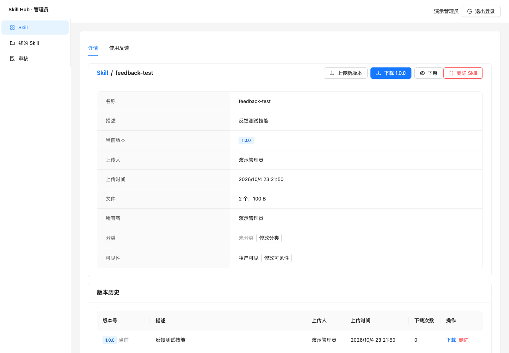
*上传 Skill 后自动跳转到详情页*

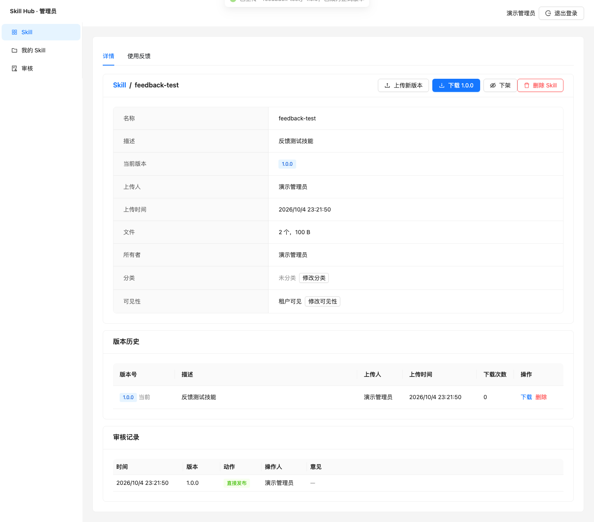
*点击"使用反馈"标签切换到反馈功能*

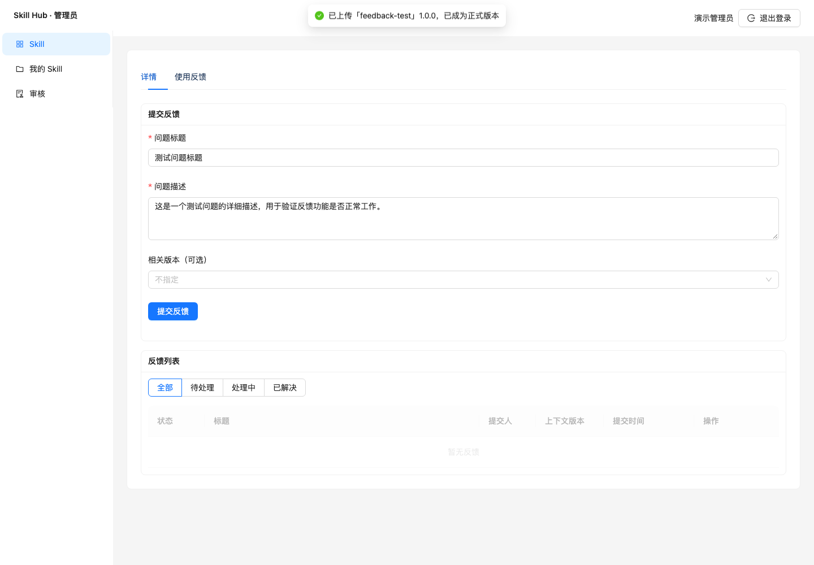
*填写问题标题和描述，可选择相关版本*


*反馈提交后显示在列表中，状态为"待处理"*

#### 测试 2: URL 参数 tab=feedback 可以切换到反馈标签

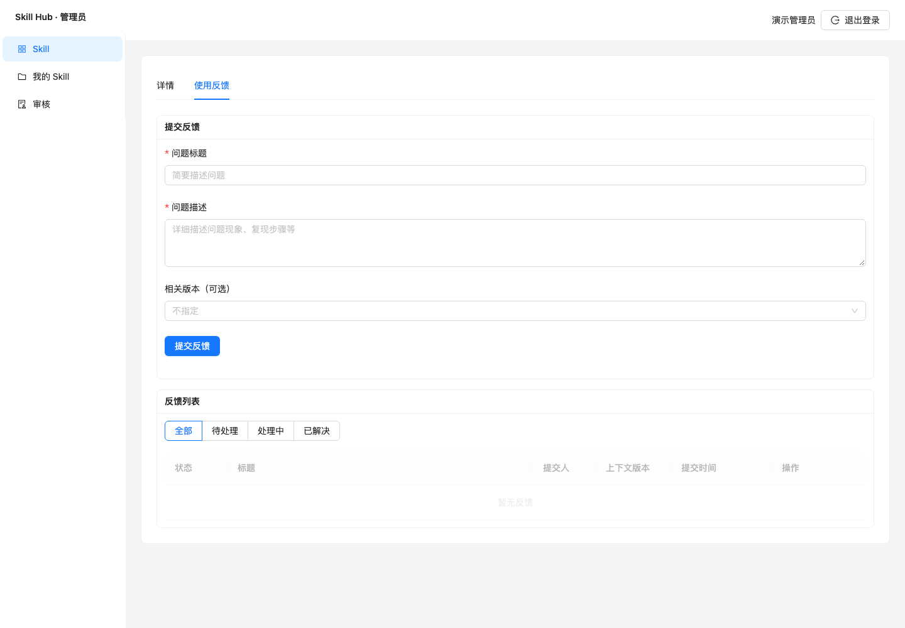
*通过 `?tab=feedback` 参数直接切换到反馈标签*

---

## Issue #03: 反馈状态管理

### 验收标准

- [x] 作者或租户管理员可看到反馈管理按钮
- [x] 可将反馈状态从"待处理"改为"处理中"
- [x] 可将反馈状态从"处理中"改为"已解决"
- [x] 标记"已解决"时需填写处理说明
- [x] 状态变更后列表实时更新

### 测试证据

**e2e 测试**: `apps/web/e2e/feedback.spec.ts` - 2 tests passed

#### 测试 1: 作者可以管理反馈状态

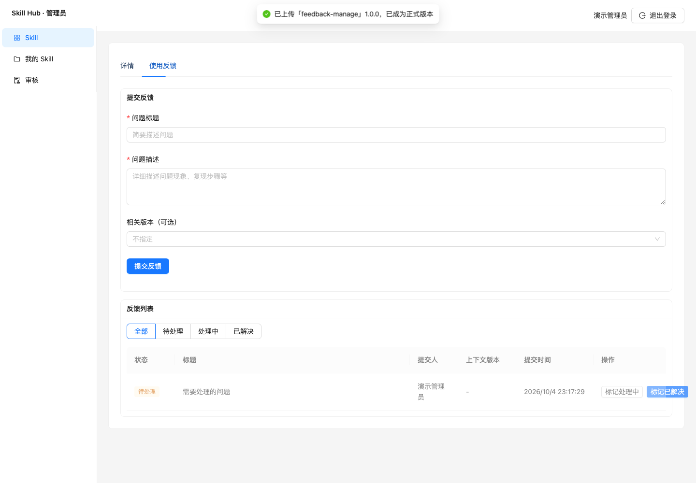
*作者/管理员可看到"标记处理中"和"标记已解决"按钮*

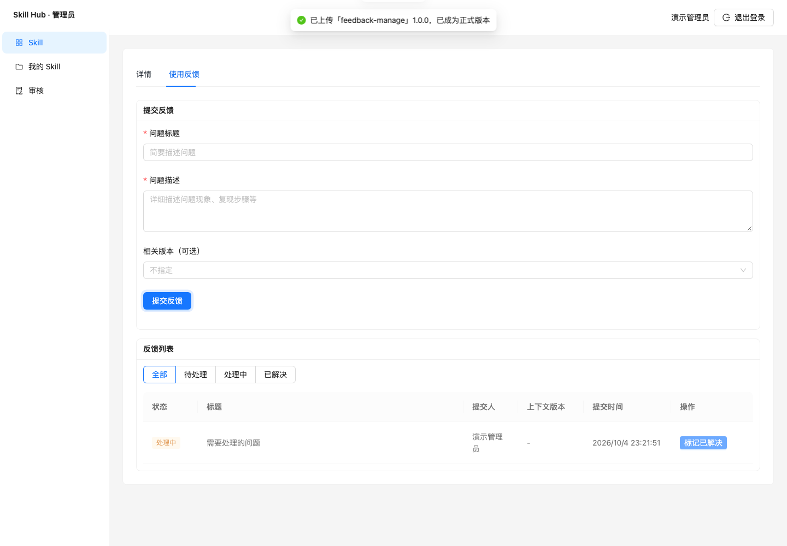
*点击"标记处理中"后状态更新为"处理中"*

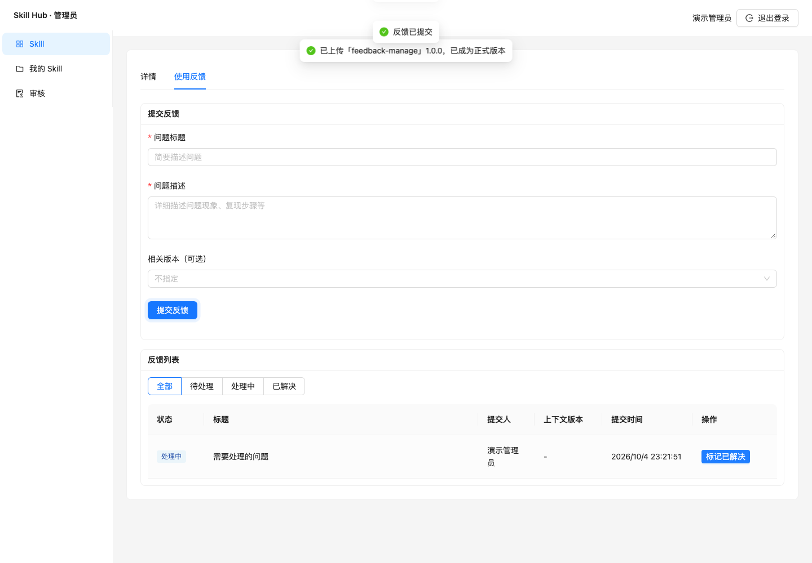
*标记已解决时需要填写处理说明*

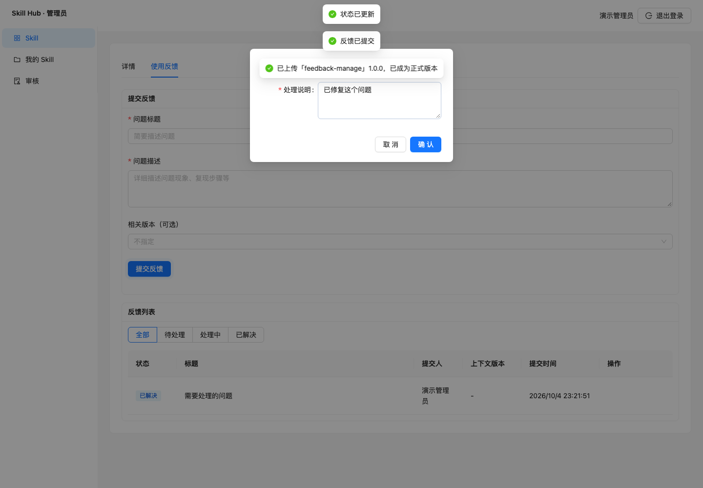
*反馈状态更新为"已解决"*

#### 测试 2: 状态筛选功能正常

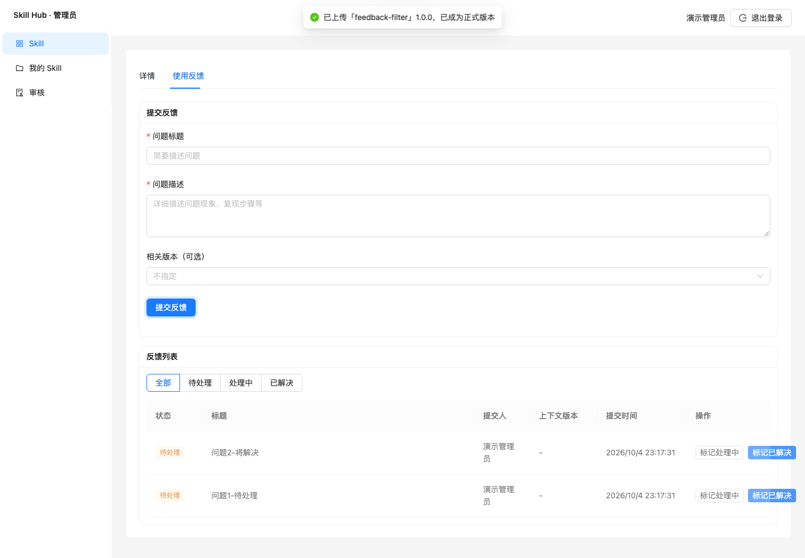
*显示所有状态的反馈*

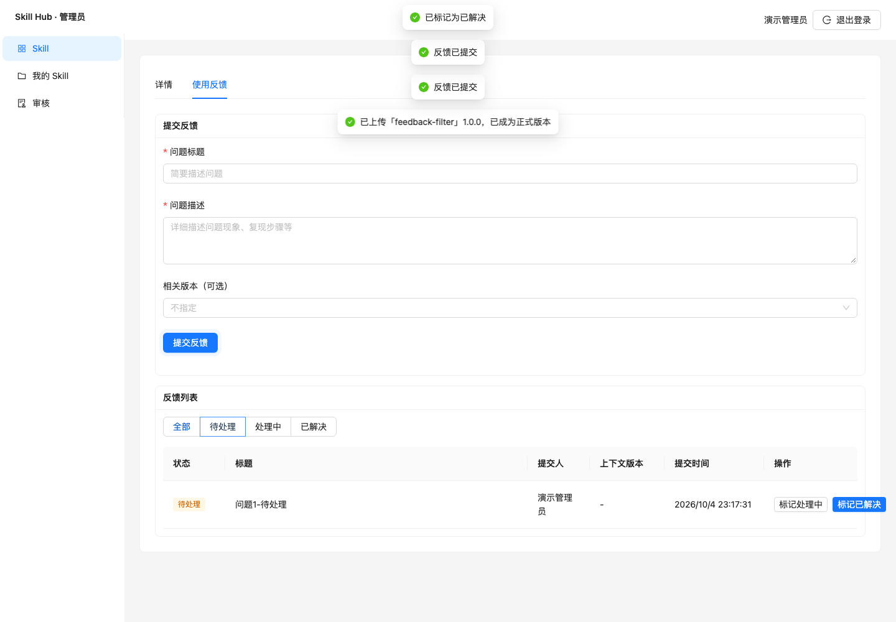
*只显示待处理的反馈*

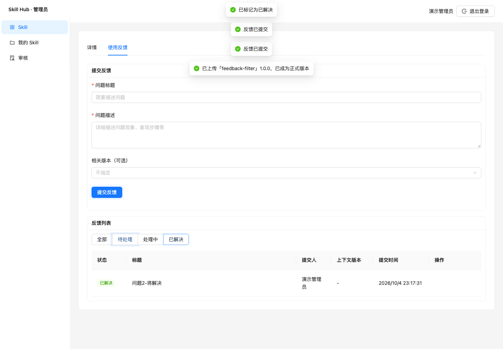
*只显示已解决的反馈*

---

## Issue #04: 我的 Skill 待处理反馈入口

### 验收标准

- [x] "我的 Skill"页面增加"待处理反馈"列
- [x] 显示待处理反馈数量（Badge）
- [x] 无待处理反馈时显示"—"
- [x] 点击数量可跳转到该 Skill 的反馈标签页

### 测试证据

**e2e 测试**: `apps/web/e2e/feedback.spec.ts` - 1 test passed

#### 测试: 我的 Skill 显示待处理反馈数量

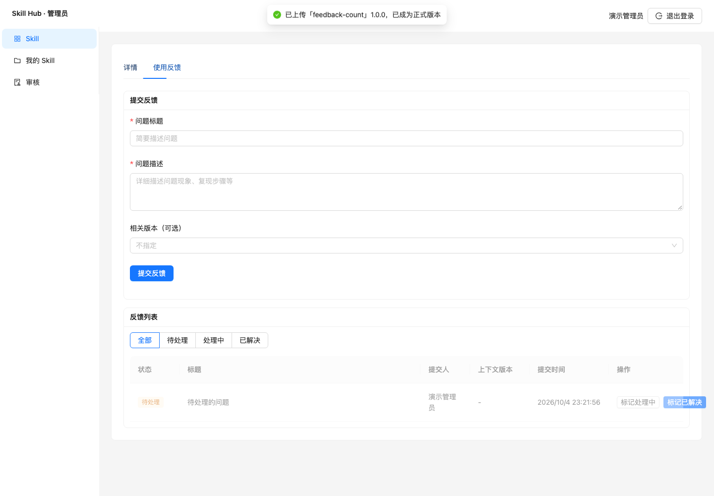
*"我的 Skill"页面显示待处理反馈数量 Badge，点击可跳转到反馈标签页*

---

## 测试汇总

| 测试类型 | 总数 | 通过 | 失败 |
|---------|-----|-----|-----|
| API 测试 | 177 | 177 | 0 |
| 浏览器测试 | 11 | 11 | 0 |
| **总计** | **188** | **188** | **0** |

### 测试命令

```bash
# API 测试
pnpm --filter @skill-hub/server test:e2e

# 浏览器测试
pnpm --filter @skill-hub/web test:e2e
```

### 测试耗时

- API 测试: ~16s
- 浏览器测试: ~35s
- **总计**: ~51s

---

## 改动文件清单

### 后端
- `apps/server/prisma/schema.prisma` - 新增 FeedbackStatus 枚举和 SkillFeedback 模型
- `apps/server/src/skills/skill-feedbacks.service.ts` - 反馈业务逻辑
- `apps/server/src/skills/skill-feedbacks.controller.ts` - 反馈 API 端点
- `apps/server/src/skills/skills.dto.ts` - 反馈 DTO
- `apps/server/src/skills/skills.service.ts` - mine() 增加待处理反馈统计
- `apps/server/src/skills/skills.module.ts` - 注册反馈模块

### 共享
- `packages/shared/src/skill.ts` - 反馈相关类型定义

### 前端
- `apps/web/src/pages/SkillsPage.tsx` - Skill 详情页反馈标签页
- `apps/web/src/pages/MySkillsPage.tsx` - 我的 Skill 待处理反馈列

### 测试
- `apps/server/test/skill-feedback.e2e-spec.ts` - API 测试 (25 tests)
- `apps/web/e2e/feedback.spec.ts` - 浏览器测试 (5 tests)

### 文档
- `docs/test-reports/feedback/README.md` - 本验收报告
- `docs/test-reports/feedback/*.png` - 13 张测试截图
